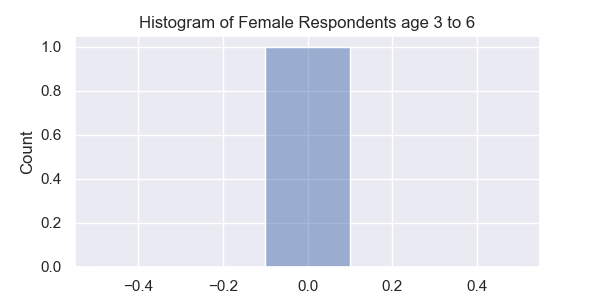

# **Pharmaceutical Research and Branding of Adderall**

In this project I summarized two scientific papers on Adderall, performed sentiment analysis on Adderall reviews from WebMD, and created marketing materials for a potential new Adderall product. The additional reports, code and outputs can be found in the repo.
______
## Branding and Marketing Materials
### Five new drug names were generated by a model based on this research:
1) Focusil (a combination of "focus" and the suffix "-sil," which is commonly used in brand names for medications)
2) CerebroXR (a name that suggests a long-lasting effect on cognitive function, with "Cerebral" meaning "relating to the brain")
3) NeuroSharp (a name that implies both neurological and sharpness benefits)
4) AttentiaXL (a name that emphasizes attention and the idea of extended duration)
5) MentalClear (a name that suggests a clearing or improving of mental function)
I decided to reccommend Focusil.

### Potential logos were generated for Focusil:

### The following marketing images were generated for Focusil:

______
## Summaries of Pubmed Research on Adderall
Using T5 I generated summaries of each page for both research papers.
### Key Takeaways:
* Online pharmacies offering adderrall are fraught with illegitimacy
* Most illegitimate online pharmacies offering adderall experience low traffic, and the majority of them provide at least some warnings, precautions, and drug information.
* Pharmaceutical accrediting agencies such as NABP and PCCA should move to improve their online screening and surveillance.
* The risk of abuse is higher than average with adderall users.
* The most effective treatments for ADHD are methylphenidate and amphetamine.
* Adderall users are at risk of new-onset psychosis, however the frequency is between 0.1% and 0.2%.
* There is a slightly higher risk of psychosis with amphetamine than with methylphenidate, this could be explained by higher rate of substance use or more severe psychiatric illness.
* Among those who experienced psychosis, the median time from dispensation of the first stimulant to the psychotic episode was 128 days
* Physicians should consider the risks and symptoms of psychosis when prescribing Adderall.
______
## Sentiment Analysis of WebMD Adderall Reviews
### Sentiment by Age and Sex

* Based on this analysis the drug is highly effective for women over the age of 55 and potentially problematic for girls under the age of 13.
* Girls and women between 13 and 55 show consistently positive sentiment. 
* Boys and men's sentiment is more consistently positive across the age spectrum.
* Men above 19 are especially consistent with positive sentiment, only dropping off slightly for men above the age of 64.

### Histograms

* There is only one respondent in the female age 3-6 category. With a score of 0, this drug is likely a poor choice for this age range.
* Respondents in the female age 3-7 category are split between very high and very low scores, caution should be advised before prescribing for this cohort.

