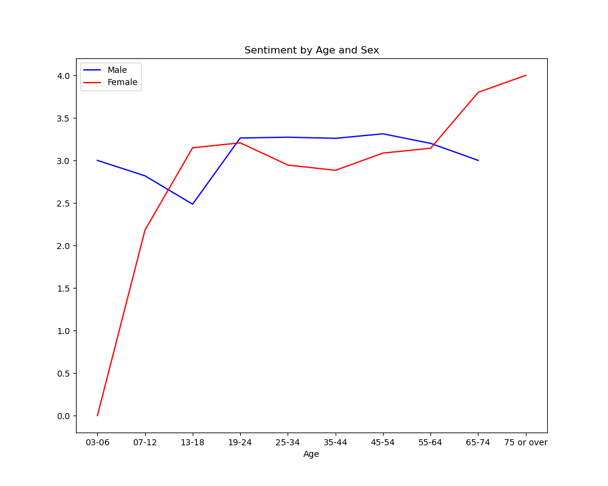
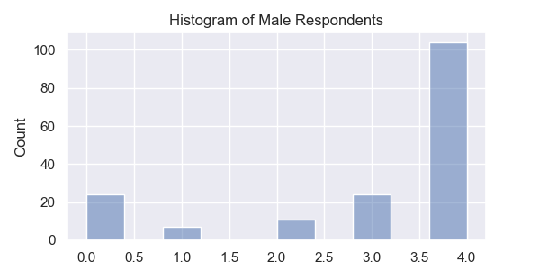

# Sentiment Analysis of WebMD Adderall Reviews
Using LiYuan's Sentiment Analysis model trained on Amazon reviews I was able to get sentiment scores for Adderal reviews from WebMD.
### Sentiment by Age and Sex

* Based on this analysis the drug is highly effective for women over the age of 55 and potentially problematic for girls under the age of 13.
* Girls and women between 13 and 55 show consistently positive sentiment. 
* Boys and men's sentiment is more consistently positive across the age spectrum.
* Men above 19 are especially consistent with positive sentiment, only dropping off slightly for men above the age of 64.

### Histograms

* There is only one respondent in the female age 3-6 category. With a score of 0, this drug is likely a poor choice for this age range.
* Respondents in the female age 3-7 category are split between very high and very low scores, caution should be advised before prescribing for this cohort.