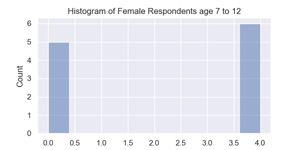

# Sentiment Analysis of WebMD Adderall Reviews
### Sentiment by Age and Sex

* Based on this analysis the drug is highly effective for women over the age of 55 and potentially problematic for girls under the age of 13.
* Girls and women between 13 and 55 show consistently positive sentiment. 
* Boys and men's sentiment is more consistently positive across the age spectrum.
* Men above 19 are especially consistent with positive sentiment, only dropping off slightly for men above the age of 64.

### Histograms

* There is only one respondent in this category with a score of 0, this drug is likely a poor choice for this age range.

* Respondents in this cateogry are split between high and low scores, caution should be advised before prescribing for this cohort.